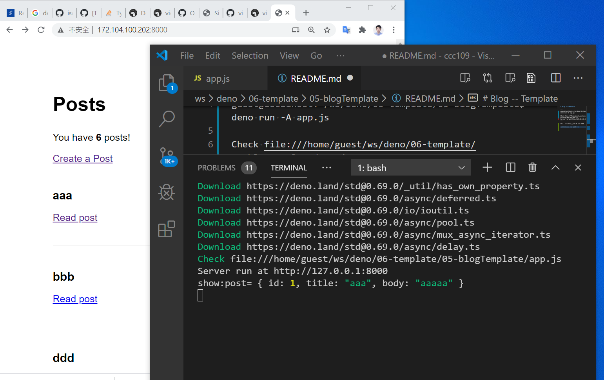

# Blog -- Template

user@DESKTOP-96FRN6B MINGW64 /d/ccc109
$ ssh guest@misavo.com
guest@misavo.com's password: 
guest@localhost:~$ ls
ccc  ws
guest@localhost:~$ cd ws/deno/06-template/05-blogTemplate/
guest@localhost:~/ws/deno/06-template/05-blogTemplate$ ls
app.js  blog.db  public  README.md  views
guest@localhost:~/ws/deno/06-template/05-blogTemplate$ deno run -A app.js
Server run at http://127.0.0.1:8000
```

然後觀看 http://127.0.0.1:8000

若在 misavo.com 上請看 http://172.104.100.202:8000/

結果如下圖所示：




