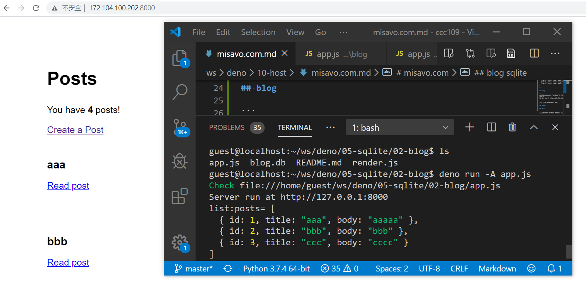
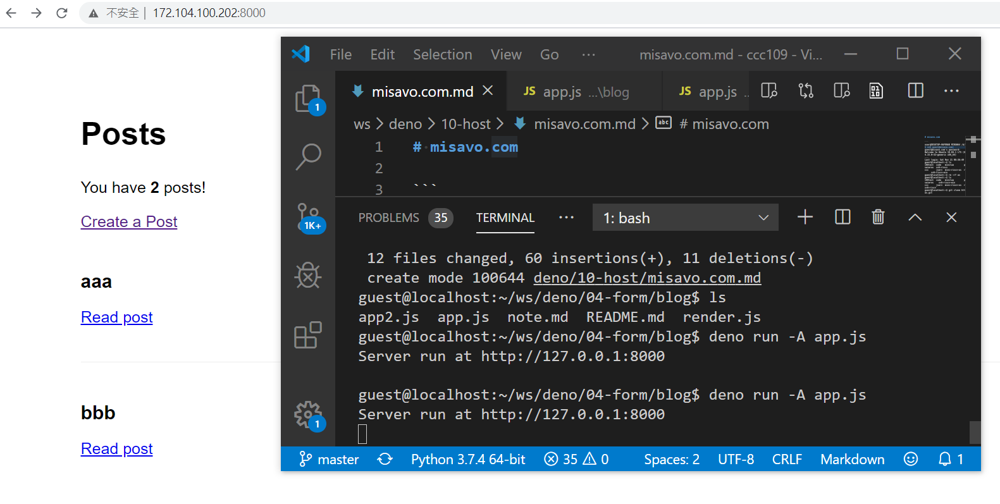

# 教師提供的雲端主機

## blog sqlite



```
user@DESKTOP-96FRN6B MINGW64 /d/ccc109
$ ssh guest@misavo.com
guest@misavo.com's password: 
guest@localhost:~$ ls
ccc  ws
guest@localhost:~$ ls
ccc  ws
guest@localhost:~$ cd ws/deno/06-template/05-blogTemplate/
guest@localhost:~/ws/deno/06-template/05-blogTemplate$ ls
app.js  blog.db  public  README.md  views
guest@localhost:~/ws/deno/06-template/05-blogTemplate$ deno run -A app.js
Server run at http://127.0.0.1:8000
```

然後觀看 http://127.0.0.1:8000

若在 misavo.com 上請看 http://172.104.100.202:8000/

結果如下圖所示：


## blog

```
guest@localhost:~/ws/deno/04-form/blog$ deno run -A app.js
Server run at http://127.0.0.1:8000
```



## blog

## hello

```
user@DESKTOP-96FRN6B MINGW64 /d/ccc109/ws (master)
$ ssh guest@misavo.com
guest@misavo.com's password: 
Welcome to Ubuntu 18.04.1 LTS (GNU/Linux 4.15.0-32-generic x86_64)
...
Last login: Sat Nov 21 08:36:49 2020 from 111.71.218.40
guest@localhost:~$ ls
108test  code   minilua        picoc          shecc  swieros  xv6-riscv
ccc      jserv  mini-riscv-os  riscv-hello-c  sp     ws       xv6-riscv-win
guest@localhost:~$ rm -rf ws
guest@localhost:~$ ls
108test  code   minilua        picoc          shecc  swieros    xv6-riscv-win       
ccc      jserv  mini-riscv-os  riscv-hello-c  sp     xv6-riscv
guest@localhost:~$ git clone https://gitlab.com/ccc109/ws.git
Cloning into 'ws'...
remote: Enumerating objects: 673, done.
remote: Counting objects: 100% (673/673), done.
remote: Compressing objects: 100% (461/461), done.
remote: Total 673 (delta 256), reused 540 (delta 169), pack-reused 0
Receiving objects: 100% (673/673), 225.07 KiB | 478.00 KiB/s, done.
Resolving deltas: 100% (256/256), done.
guest@localhost:~$ cd ws
guest@localhost:~/ws$ ls
deno  _more  README.md
guest@localhost:~/ws$ cd deno
guest@localhost:~/ws/deno$ ls
00-install  03-oak     06-template  09-websocket  13-pgsql
01-basics   04-form    07-session   10-host       14-elasticsearch
02-http     05-sqlite  08-ajax      12-security   README.md
guest@localhost:~/ws/deno$ cd 03-oak/
guest@localhost:~/ws/deno/03-oak$ ls
01-basic  03-static  04-routerStatic  06-myrouter1  README.md
02-param  04-router  05-middle        07-myrouter2
guest@localhost:~/ws/deno/03-oak$ cd 01-basic/
guest@localhost:~/ws/deno/03-oak/01-basic$ ls
oak404.js     oakHello3.js  oakHello.js  oakHtml.js      README.md
oakHello2.js  oakHello4.js  oakHtml2.js  oakRedirect.js
guest@localhost:~/ws/deno/03-oak/01-basic$ deno run -A oakHello.js
start at : http://127.0.0.1:8000

guest@localhost:~/ws/deno/03-oak/01-basic$ deno run -A oakHello.js&
[1] 20891
guest@localhost:~/ws/deno/03-oak/01-basic$ start at : http://127.0.0.1:8000

guest@localhost:~/ws/deno/03-oak/01-basic$
```