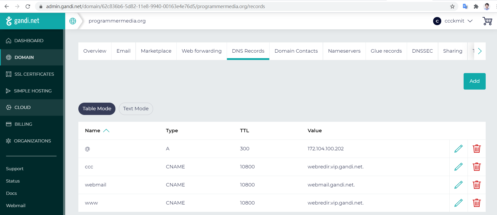
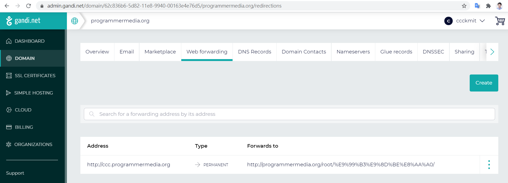
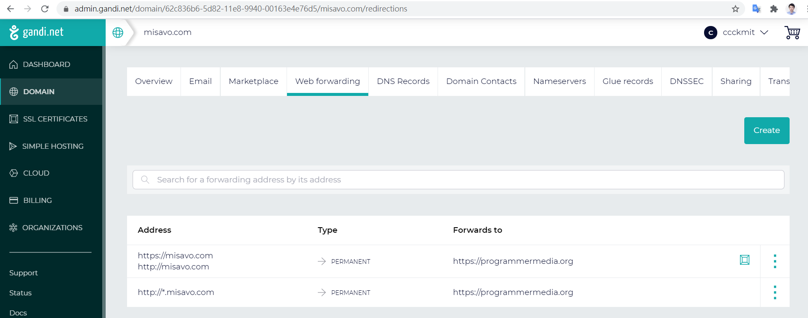

# 用deno架站經驗談

2021年2月，我開始想創建《程式人媒體》網站，於是用 deno 寫了程式後，就直接上 linode 架站了，但是碰到後來一系列問題，以下是我的經驗。


## ssh 斷線後 deno server 就被關閉

這個問題可以用 nohup 解決，例如

```
nohup deno run -A --unstable app.js pmedia.json &
```

如果用以下的 pm2 就不需要用 nohup 了！

## server 每隔一段時間就會當掉一次

1. deno oak 的 SSL/TLS/https 每隔一段時間就會當掉一次。
2. deno oak 的 http 每隔一段時間就會當掉一次 (只是通常撐得比 1 久)。

為了解決這個問題，我嘗試過下列方案。

1. 使用 shell script 寫無窮迴圈，每次當掉後再重新執行。
    * 但是行不通，因為 deno 當掉之後不會跳出來，程式還在，但就是沒有回應！
2. 使用 pm2 去執行 deno ，但是沒有設 restart time。
    * pm2start.sh : pm2 start ./pmediaApp.sh
    * pmediaApp.sh : deno run -A --unstable app.js pmedia.json
    * 但是這樣還是無法解決當掉沒回應的問題
3. 使用 pm2 去執行 deno ，加上 -f --cron 強制 讓 crontab 重啟程式 (以下 */8 * * * * 代表每8分鐘重啟)
    * pm2start.sh : pm2 start ./pmediaApp.sh -f --cron="*/8 * * * *"  
    * pmediaApp.sh : deno run -A --unstable app.js pmedia.json


## https 的問題

1. 使用 cloudflare 去將 http 轉 https，並將 gandi DNS 改為 external 的 cloudflare
    * 感覺不好用，後來改回繼續用 gandi 的 DNS
2. 使用 nginx 去將 https 加密後轉到 http
    * 可行，但轉到 http 後還當掉的問題，還是得靠 pm2 設定重啟時間解決

nginx 設定檔 (ubuntu) 在 /etc/nginx/nginx.conf 裏，其中會引用 sites-enabled/* ，所以你只要在 sites-enabled 裡放入的檔案都會被 nginx 視為設定檔執行。

```
root@localhost:~/site/app# cat /etc/nginx/sites-enabled/programmermedia.org

server {
        listen 443 ssl;
        server_name programmermedia.org;

        ssl_certificate /etc/letsencrypt/live/programmermedia.org/cert.pem;
        ssl_certificate_key /etc/letsencrypt/live/programmermedia.org/privkey.pem;

        location / {
            proxy_pass http://127.0.0.1:80/;
        }
}
```

重啟時

```
root@localhost:~/site/app# cat nginxStart.sh
nginx -c /etc/nginx/nginx.conf
nginx -s reload
```

## gandi DNS 設定

DNS Records Text

```
@ 86400 IN SOA ns1.gandi.net. hostmaster.gandi.net. 1614432231 10800 3600 604800 10800
@ 300 IN A 172.104.100.202
ccc 10800 IN CNAME webredir.vip.gandi.net.
webmail 10800 IN CNAME webmail.gandi.net.
www 10800 IN CNAME webredir.vip.gandi.net.
```



Web Forwarding



另外、我原本還沒到期的 `*.misavo.com` 也轉址到 `*.programmermedia.org` ，畫面如下


