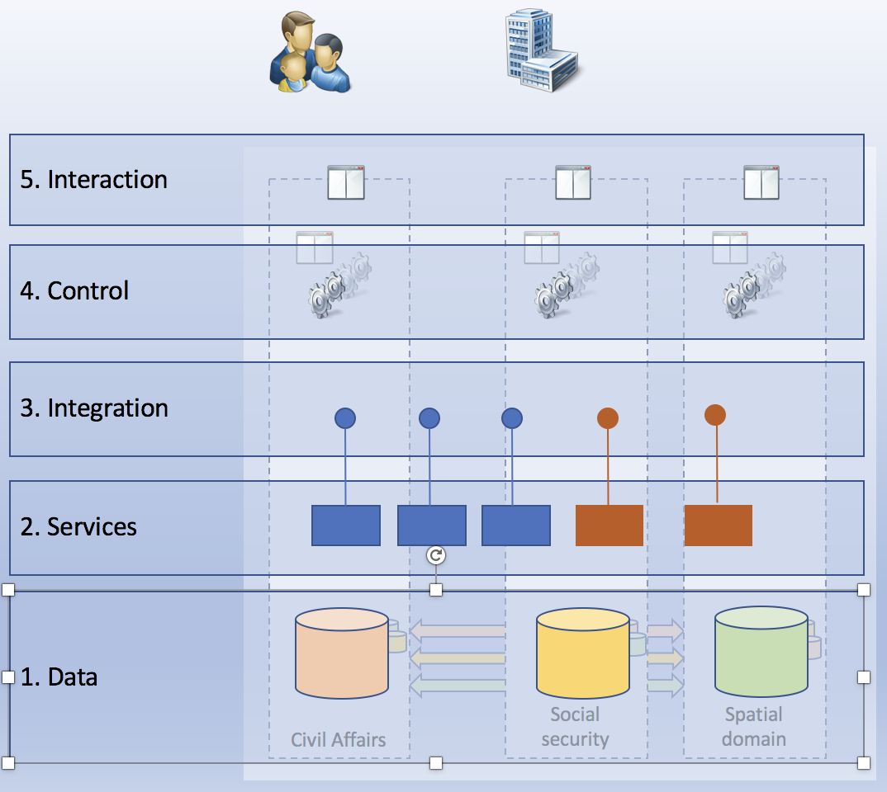
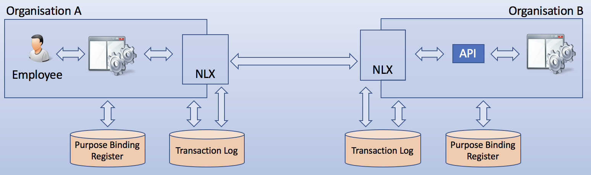

# NLX in Common Ground

* https://gitlab.com/commonground

## NLX

荷蘭版的 x-road

* https://docs.nlx.io/
* https://gitlab.com/commonground/nlx/
    * (MIRROR) https://github.com/VNG-Realisatie/nlx/

NLX is an open source inter-organisational system facilitating federated authentication, secure connecting and protocolling in a large-scale, dynamic API landscape.

## CommonGround

NLX 是荷蘭版的 X-Road, 是 Common Ground 系統的核心部分。

* https://github.com/VNG-Realisatie/common-ground/
